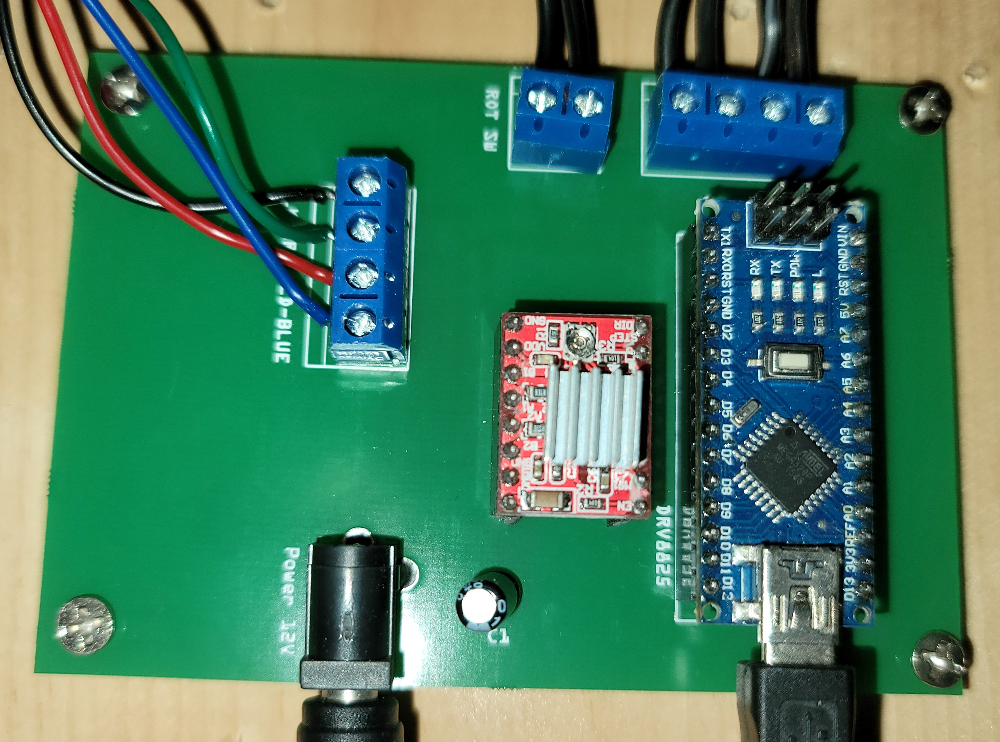
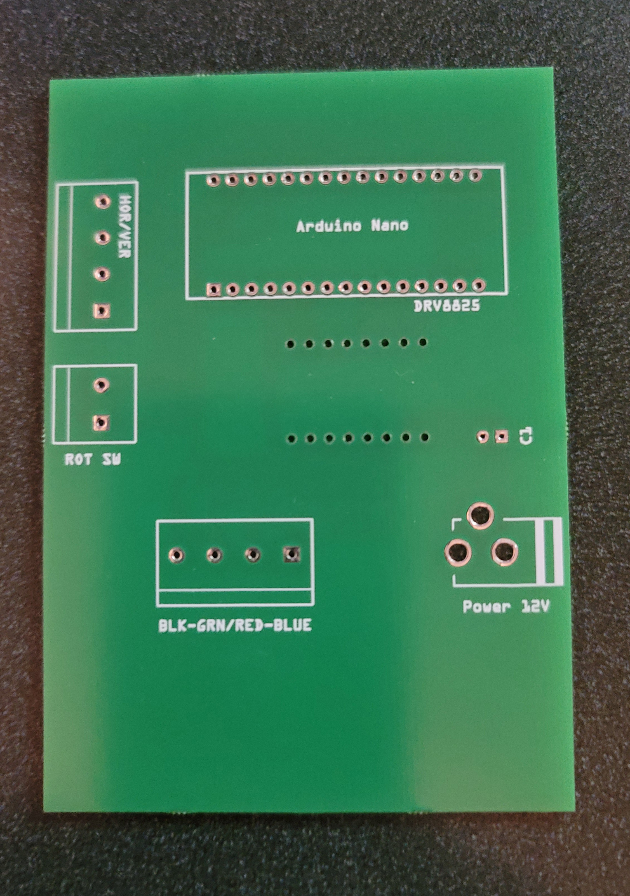
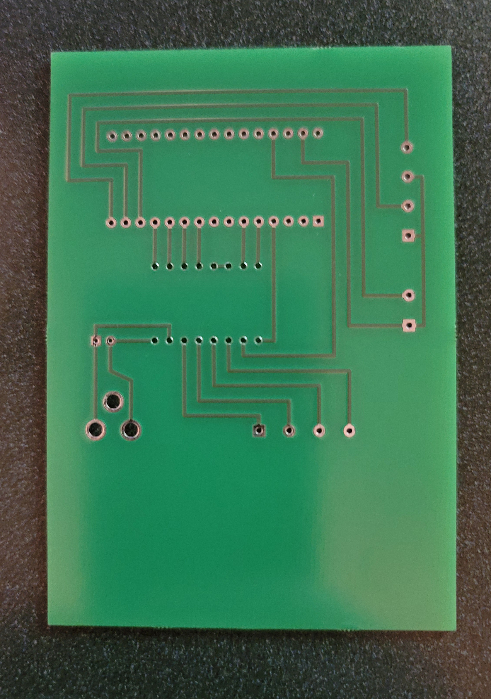

### Description

This project was designed to customize a MAME arcade cabinet I built. These retro games were built to either run 
vertically or horizontally. Typically MAME arcades are built for a certain monitor orientation. I built this project 
to automatically control the orientation of the monitor using a stepper monitor and a custom designed pcb board, 
controlled by this arduino script. Written in C for Arduino and includes a custom bat file that communicates with 
the controller board via USB.

### GameEx Setup

1.	Install the board and connect to the computer via USB.
2.	Get the COM port assigned by Windows by looking in the System Control Panel.
3.	Modify the controlMonitor.bat file to use the correct COM port.
4.	In GameEx Settings, add the plugin: QuickLaunch.

### QuickLaunch Setup

In the config page for QuickLaunch, under the MAME setting, create 2 processes using these settings:

- Rotate Monitor:
    - exe location: (path to the controlMonitor.bat file)
    - arguments: [ORIENTATION]
    - launch type: Launch Before
    - advanced: Run On Thread
    
- Reset Monitor:
    - exe location: (path to the controlMonitor.bat file)
    - arguments: H
    - launch type: Launch After
    - advanced: none
    
### Notes:
* ensure the bat file is using the correct COM port or GameEx will not communicate with the controller board
* for the Rotate Monitor arguments, be sure it is exactly as typed: [ORIENTATION]

### Custom Controller Board:

PCB 01
PCB 02
PCB 03